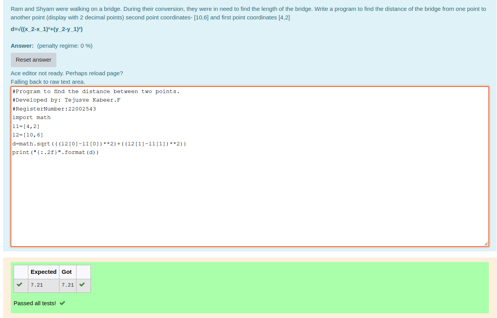

# DISTANCE-BETWEEN-TWO-POINTS

## AIM:

To write a python program to find the distance two 2 points

## ALGORITHM:

### Step 1: 
initialise using import math

### Step 2: 
enter the input

### Step 3: 
Substitute the values in the distance formula  

### Step 4: 
round the given value using format specifier

### Step 5: 
End of the program

### PROGRAM:
```python
#Program to find the distance between two points.
#Developed by: Tejusve Kabeer.F
#RegisterNumber:22002543
import math
l1=[4,2]
l2=[10,6]
d=math.sqrt(((l2[0]-l1[0])**2)+((l2[1]-l1[1])**2))
print("{:.2f}".format(d))
```
### OUTPUT:


### RESULT:
thus the distance between two points successfully executed
